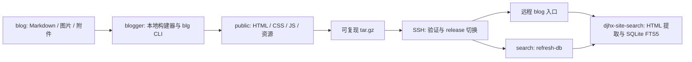

# 架构与设计取舍

## 三个项目

`blog` 保存内容，不包含生成器实现。`blogger` 负责读取、渲染、资源处理和部署，不需要搜索数据库连接。`djhx-site-search` 独立服务，从生成后的 HTML 提取文章，不依赖源 Markdown。最后的刷新接口仍保持 GET 兼容调用，增加超时和结果检查。

## 构建事务

1. 校验源/输出关系、目录类型和旧输出所有权，获取输出父目录的独占 lock。
2. 用 `os.scandir` 按稳定顺序扫描一次目录树。局部 `Node` 树取代跨构建存活的全局映射；解析每份 Markdown 一次。
3. 在输出父目录创建随机暂存目录。先生成分类页，随后复用或处理文章与附件，所有 futures 都必须成功。
4. 重新验证源文件内容摘要，检测构建期间编辑；生成归档、内置资源与构建清单。
5. 将旧输出改名为随机备份，再把暂存目录改名为 `public`；第二次改名失败时恢复旧输出。
6. 清理备份和 lock，返回统计。失败清理暂存目录，旧 `public` 保留。

暂存目录与最终输出处于同一文件系统，避免跨盘复制导致半成品目录。目录替换由两次改名完成，存在很短的入口间隙；它用于本地构建，不承诺在线站点的无间隙切换。远程正常部署使用原子的符号链接替换。

输出所有权通过 `.blogger-build.json` 的 generator/schema 确认；兼容旧版 `index.html + archive.html + css + images` 的标准输出布局。不覆盖未知目录。中断或断电可能留下 lock/随机备份；恢复步骤见使用手册。构建缓存丢失或损坏时退化为重新构建，不作为内容的唯一来源。

## 缓存与性能

每个源文件记录 SHA-256、处理配置指纹、相对输出路径、输出摘要。复用条件同时包含输入、处理策略与已有输出的完整性。Markdown 指纹包含模板、站点配置、生成器与渲染依赖版本；图片指纹包含 Pillow 版本、质量和尺寸。分类与归档在每次构建中重新生成，因此新增、删除、改名或日期修改都会反映到导航。

并行使用局部 `ThreadPoolExecutor`，默认 4 个工作线程，最多提交两倍工作数的 pending futures。这样不需要 Windows spawn 子进程启动，也不在模块导入时消耗资源。Pillow 编码和文件 IO 可以并行；Markdown 部分受 Python GIL 限制，不宣称线程数越多越快。所有错误显式传播，任务完全结束才切换输出和打包。

缓存复用使用普通复制，不使用硬链接，避免修改新输出污染旧输出。源文件和输出都做内容摘要而非只看 mtime，支持时间戳保留、同尺寸修改和产物损坏。一次构建仍需要扫描与摘要 IO，增量构建不是零成本。

归档使用稳定文件顺序、固定 uid/gid/mtime、固定 gzip 时间戳，排除隐藏的构建状态；相同输入与压缩等级产生相同字节。默认 gzip level 1，适合以 JPEG 为主的站点。

## 安全边界

| 边界 | 处理 |
| --- | --- |
| 元数据进入模板 | 安全 YAML、字段类型检查、Jinja 自动转义 |
| 源目录边界 | 拒绝符号链接/junction/特殊文件，拒绝输出重叠和目录穿越 |
| 原始 Markdown HTML | 保留作者 HTML，仅对可信内容使用；不做不可信 HTML 清洗 |
| 图片解码 | 保留安全默认像素限制，把解压炸弹警告提升为构建失败 |
| SSH 服务器身份 | 使用 known_hosts 与 RejectPolicy，不自动信任新 key |
| 远程命令 | 参数用 POSIX shell 引号，不拼接未转义路径 |
| 归档展开 | 仅允许 public 下的普通文件/目录，拒绝链接、穿越、重复项，总展开上限 20 GiB |
| 上传完整性 | 本地计算 SHA-256，远程在展开前验证 |
| 远程切换 | 先完整准备 release、校验首页/归档，再替换入口；保留上一版 |
| 凭据 | 环境变量或交互输入，不保存至配置/日志/归档 |

上传摘要验证传输完整性；服务器必须已经通过 SSH 主机身份校验，且上传账户和远程父目录是可信的。作者能写正文 HTML/附件，这也是允许发布代码、SVG 和嵌入内容的能力，不构成多租户隔离。

## HTML 与搜索的约定

页面头部写入 `meta[name="blogger:page"]`，值为 `article/category/archive`；文章具有 `article h1`、`.article-content` 和 `article:published_time`，草稿状态另存 `blogger:draft`。

搜索服务优先识别这个标记。没有标记的旧页面继续使用原目录判断，从而兼容尚未重建的旧站点。新协议可以识别带 PDF/文本附件、子目录及独立 Markdown 页的文章，同时排除空分类页。草稿没有从索引中过滤。
